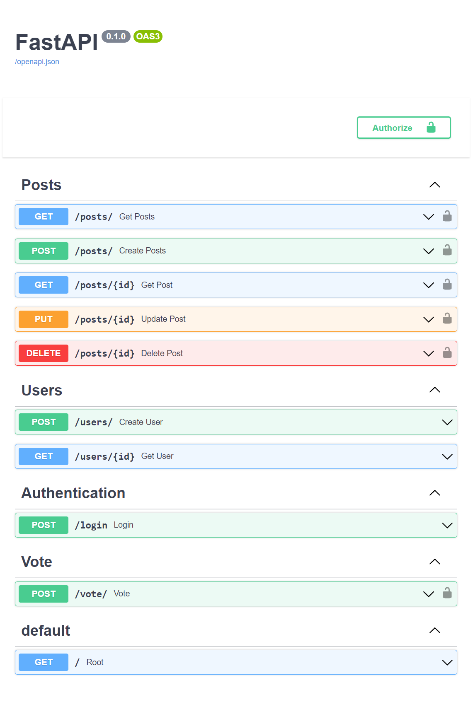

 

  

  <a href="https://fastapi-example-bruce.herokuapp.com/docs">View Demo</a>

<!-- TABLE OF CONTENTS -->

  
Table of Contents

  <ol>
    <li>
      <a href="#about-the-project">About The Project</a>
      <ul>
        <li><a href="#built-with">Built With</a></li>
      </ul>
    </li>
    <li><a href="#acknowledgments">Acknowledgments</a></li>
  </ol>

<!-- ABOUT THE PROJECT -->
## About The Project
Learn Python API development in one of the most comprehensive courses ever on the topic. You will build a full-fledged API in Python using FastAPI. You will learn the fundamentals of API design including routes, serialization/deserialization, schema validation, and models. You will also learn about SQL, testing with pytest, and how to build out a CI/CD pipeline using GitHub actions.

(<a href="#top">back to top</a>)

### Built With

* [Python](https://www.python.org)
* [FASTAPI](https://fastapi.tiangolo.com/)
* [PostgreSQL](https://www.postgresql.org/)
* [Docker](https://www.docker.com/)
* [Heroku](https://id.heroku.com/login)
* [GitHub Actions](https://docs.github.com/en/actions)

(<a href="#top">back to top</a>)

## Acknowledgments

* [freeCodeCamp.org](https://www.youtube.com/c/Freecodecamp)
* [Sanjeev Thiyagarajan](https://www.youtube.com/channel/UC2sYgV-NV6S5_-pqLGChoNQ)
* [Tutorial](https://youtu.be/0sOvCWFmrtA)

(<a href="#top">back to top</a>)

